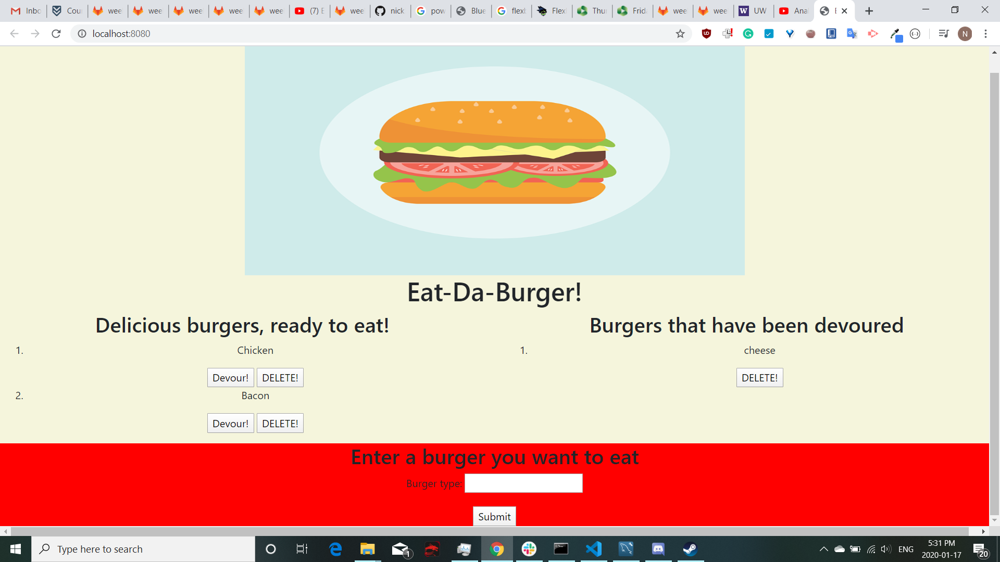

# BurgerLogger
This project allows users to create, devour and delete burger through utilization of a mysql server. It utilizes express, express-handlebars and mysql npm. This application uses get, post, put and delete routes utilizing all four basic CRUD operations. It also uses css, img and js files located in a static public folder. This application utilizes Bootstrap styling. Utilizes a custom orm.js file. Deployed on Heroku.
